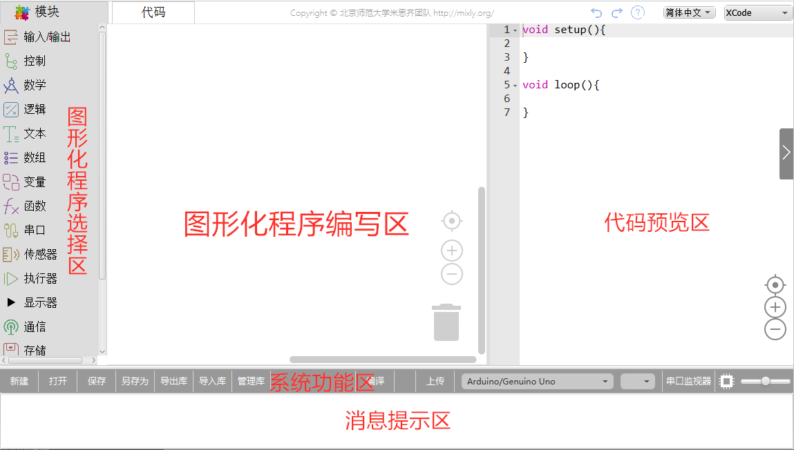

# 少儿编程工具/平台汇总

> ## 1 米思齐（Mixly)

是一款由北京师范大学付骞教授带领的团队研发的一款带有公益性质的免费arduino图形化编程软件。

 下图所示为米思齐编程界面（图片源自米思齐官方）： 

**支持硬件**

米思齐打通了部分硬件平台，指令方块在部分兼容arduino和Python的主板上都可以运行。

- Arduino编程部分支持主板：UNO、Nano、mega2560、Leonardo、 Generic ESP8266 Module 、 NodeMCU 1.0 (ESP-12E Module) 、 LOLIN(WEMOS) D1 R2 & mini 、 WeMos D1 R1 、 ESP32 Dev Module 、 MixGo 、 掌控版 、 MixePi 。

- microPython编程部分支持主板： MicroPython[ESP32_Generic] 、掌控版、  ESP32_MixGo 、microbit。

**编程语言**

- 图形化编程：类似scratch编程，但是没有舞台
- C/C++：可以像Arduino IDE一样编程
- Python：类似Python的IDLE，可以运行基本的Python程序，可跳出海龟画图的画布
- MicroPython：能够编写能下载到控制板中的程序，遵循microPython语法规则

**特点**

- 拓展性：支持导入自制图形化库
- 丰富：含有arduino大部分常见传感器的指令方块，并保持不断更新中
- 时效性：会根据政策及教育形式开拓对应内容，比如开发了物联网，人工智能部分
- 资料：配套有较详细的使用文档、配套视频教程
- 公益性：不收取费用，没有较复杂的利益关系，主打开源硬件，很适合作为自制课程的平台

**不足**

- 无舞台，不能用于开展scratch教学
- 程序编译下载速度不稳定，有时会遇到一个程序下载需要近1分钟
- microbit部分支持能力较弱
- 无在线版，需要花费较多时间进行课前准备配置环境
- 平台活跃度较低，因为没有scratch类的纯图形化编程，加上团队人员构成的原因，平台没有多少学生分享作品，案例也较少，老师与学生学习后没有很强的吸引力让学生和老师在米思齐平台分享、或参与社区建设相关事项。

**总结**

米思齐平台最适合进行arduino系列的硬件教学，Python和人工智能部分虽然也有，但是比起其他家专注于此数年的平台而言还是需要进一步优化。我个人是很看好这个平台的，它如果遇到一个会运营的人才后必然会飞快崛起，现在我认为其还是潜伏期，架构很全，但是没有人力和物力去填充这个架构。

**附录**：

1.米思齐官方网站：http://mixly.org/

2.米思齐使用文档： https://mixly.readthedocs.io/ 

3.米思齐网校： https://study.163.com/provider/480000002171531/index.htm 

> ## 2 微软Makecode系列

Makecode是微软推出的一系列免费在线编程软件，该系列目前还在不断扩充中，截至发文时刻，已有micro:bit、Circuit Playground Express、Minecraft、LEGO、CUE、Arcade、Chibi Chip六个系列，各个系列简介如下：

- micro:bit系列：为microbit设计的编程平台，自带模拟器，可添加自制拓展，也可直接使用github上其他人的拓展，支持图形化编程/js文本编程。

- Circuit Playground Express：为adafruit公司的circuit主板设计的编程平台，自带模拟器，可添加自制扩展，也可直接使用github上其他人的拓展，支持图形化编程/js文本编程。（暂无无中文界面）

- Minecraf编程：结合我的世界游戏，通过设计程序控制角色在游戏中运动、建造等，支持图形化编程、js编程、Python编程，支持中文界面、支持从github加载拓展。

- LEGO EV3编程：为乐高EV3设计的编程平台，含乐高模拟器，支持图形化编程/js编程、支持自定义拓展、从github加载其他人的拓展，支持中文界面。

- Cue：Cue是一款球形教育机器人，makecode平台上的链接点过去后会进入Cue官网，编程需要下载客户端。
- Arcade：是一个像素游戏设计平台，可以使用图形化编程或js文本编程设计一个游戏，自带模拟器，需要注意的是该平台自带游戏引擎，含有大量封装指令，可以轻松实现scratch中较难实现的游戏效果。可以将游戏下载到对应硬件，制作自己的掌上游戏机。支持自主开发插件，也支持从github导入插件，支持图形化编程/js文本编程。

- Chibi Chip编程：其是为一款chibi的主板设计，只有英文版界面，其连线类似纸电路，支持外部拓展插件。

**特点**

- 开放：makecode系列是市面上不多的支持从gitHub导入插件的软件之一，通用性较高，很多时候可以让我们在课程开发时有更多灵感和创意
- 稳定：微软的技术不用多说，平台稳定性好，而且迭代更新一直在进行，不用担心用到一半突然没人维护
- 风格统一，进阶迁移成本低：以类似的编程界面风格，让学生在进阶学习时，可以轻松在makecode几个平台间切换，迁移成本较低

**缺点**

- 前沿性较差：技术热点更新不太及时，比如Python、IOT、AI这些，没有很好地支持
- 编程入门做得不太好：在入门友好性方面，比scratch差一些，没有低封装做动画和游戏的一环（这一环在微软的另一个编程软件Kodu上得到了一定的解决）

**总结**

makecode这个系列的工具与硬件联系较好，如果不是想从纯软件做动画和游戏入门编程的话，可以试试用这一套。对于有一定scratch基础的学生，如果要继续纯软编程可以在转Python编程前学习arcade平台游戏设计；如果要转硬件编程，可以从microbit入手。

> ## 3 编程猫系列工具

编程猫是国内线上少儿编程的头部公司，不论是学员数，还是课程数，教师数都比较大。编程猫走的是多营收路线，线上课是他们营收中比较重要的一环。编程猫最大的特色是搭建了一个从预习-学习-巩固练习-应用输出比较完整的闭环，特别是在巩固练习环节用通天塔、代码岛这种游戏性较强的模式激励学生主打学习（之前还有个Python的游戏，现在没看到了，那个也很好玩不错）

编程猫的工具主要有三个：kitten源码编辑器、代码岛Box、海龟编辑器

- kitten源码编辑器：一款类似scratch的编辑器，不过有很多有意思的拓展，支持给背景设置运动指令，支持一些人工智能插件，支持物理引擎（角色间可以像现实中那样发生碰撞和反弹），软件有在线版也有离线版。

- 代码岛Box：代码岛Box类似makecode.mc，通过编程控制像素游戏世界的角色运动、建造，不过有一点比较遗憾的是角色是自己在一个悬空的岛上，可玩性没有mc高。

- 海龟编辑器：一款Python文本编程编辑器，具备代码高亮，代码提示补全功能，作为Python入门还是挺不错的，同样具备在线和离线两种版本。

**特点**

- 拓展多：在纯软件图形化编程方面，编程猫可以说是市面上做得最好的几家公司之一，编辑器稳定，拓展的插件易用性高，另外有很多素材。
- 学习链条完整：除了常见的编程工具职能，编程猫的社群运营做得很不错，从工具到活动都可以很好地调动学生学习积极性。

**缺点**

- 硬件支持弱：目前只支持四块主板，主板对应的传感器指令方块不多
- 可能存在利益冲突：因为编程猫本身是做2C和2B的教育公司，所以一些机构的老师如果要用这套体系可能会存在一些利益上的矛盾点

**总结**

如果不考虑利益冲突问题，用编程猫的平台做纯软件的少儿编程课程肯定没问题，如果要做硬件编程的话，建议换平台。另外一直感觉比较可惜的是自从19年上半年京东拿到国内mc代理后告倒一堆教育机构后，市面上用mc教编程的就少了很多，挺期待编程猫代码岛完善，做出国产版mc。

> ## 4 腾讯系列工具

腾讯有一个扣叮编程平台，这个平台有8个编程工具创意实验室、Python实验室、人工智能实验室、游戏实验室、艺术实验室、硬件实验室、JS实验室、C实验室，支持图形化、js、C、Python等语言。也培配有一些教程和课程。

- 创意实验室：其实就是scratch3进行了一些改版，不过支持掌控版、支持语音识别、涂鸦识别、姿态识别、KNN分类。如果不充钱开智启会员的话，这个平台没什么亮点，但是如果冲了钱就会多很多可以用的东西。

- Python实验室：Python文本编程工具，可以用来入门Python，支持图形化Python、代码Python。它最大的亮点是素材集成管理做得很不错。但是有一点很尴尬的是它自己封装了一个库，不支持导入第三方库。

- 人工智能实验室：这个工具主要是跑的TensorFlow.js，用来做机器学习的一些应用，但是封装度太低，高中以下基本都不太适合用这个平台搞机器学习。语言方面支持图形化、js文本编程、Python文本编程。

- 游戏实验室：这个是针对6-8岁的孩子开发的一个游戏化编程平台，用户可以编程控制机器人按照要求采集星星，推炸弹，从而实现训练逻辑思维的目的。玩起来还是挺有意思的，不过纵向延伸有点少，只有方向、条件循环、有限循环、判断四种指令，比较适合学生把这个当做游戏，而不是学习平台。

- 艺术实验室：艺术实验室支持指令方块编程、js文本编程、Python文本编程，没有舞台，只有一个图形输出区和文本输出区，比较适合用来入门Python，js

- 硬件实验室：不充钱的话支持arduino和microbit，充钱后支持另外几款板子，但是支持的传感器太少了，另外也不支持第三方插件，比较咸鱼。

- js实验室：支持积木和js代码，功能挺全面的，不过指令方块模式下，代码是全英文的，没有汉化。

- C语言实验室：纯C代码编程，主打信息学奥赛。

**特点**

- 覆盖面广：从6岁到18岁都可以找到能够使用的
- 稳定性较强：腾讯的技术还是没得说，稳定性很好

**缺点**

- 散乱：7个平台之间的衔接与联系很差，虽然什么都有，但是真正用起来就会感觉什么都缺
- 需要氪金：不氪金很多功能都被锁
- 可能存在利益冲突：和上面编程猫一样，不过腾讯扣叮的在2C教育这一块做得确实有很多欠缺，课程竞争力不大。

**总结**

腾讯扣叮给人的感觉是没有深入理解一线教学的人做的总体规划，看着大，但是用来做体系化的课非常不顺畅，希望后续能够根据一线教学需求，知识架构规划进一步优化。

> ## 更新ing 

首发站点：RicoShare.icu